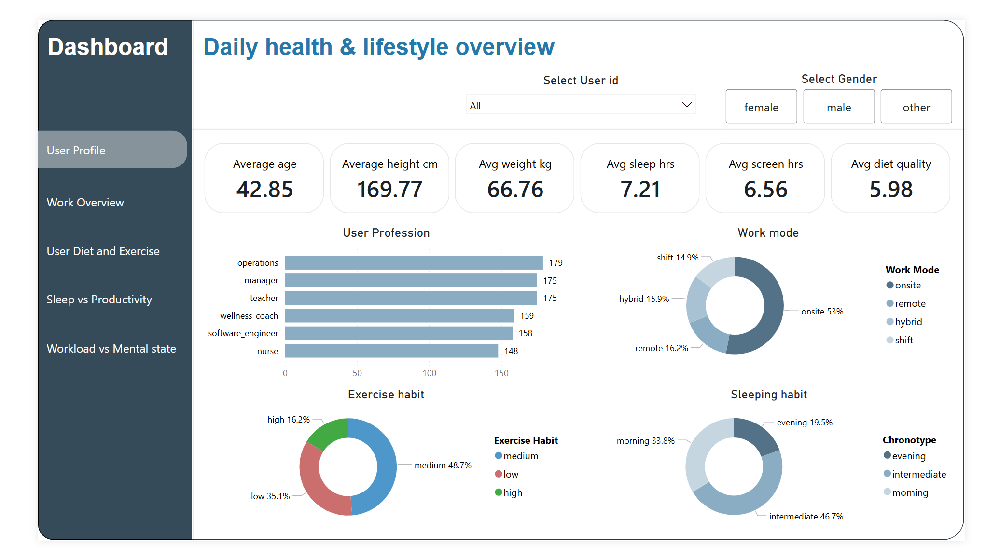
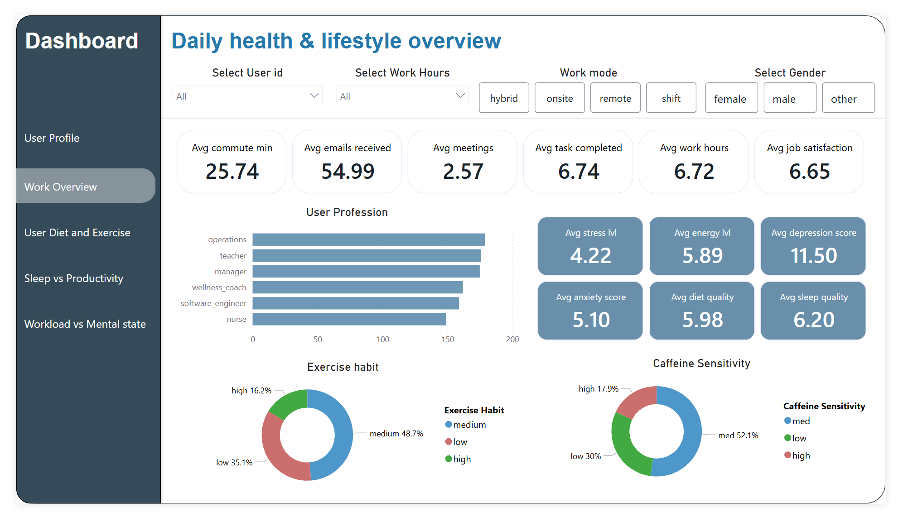
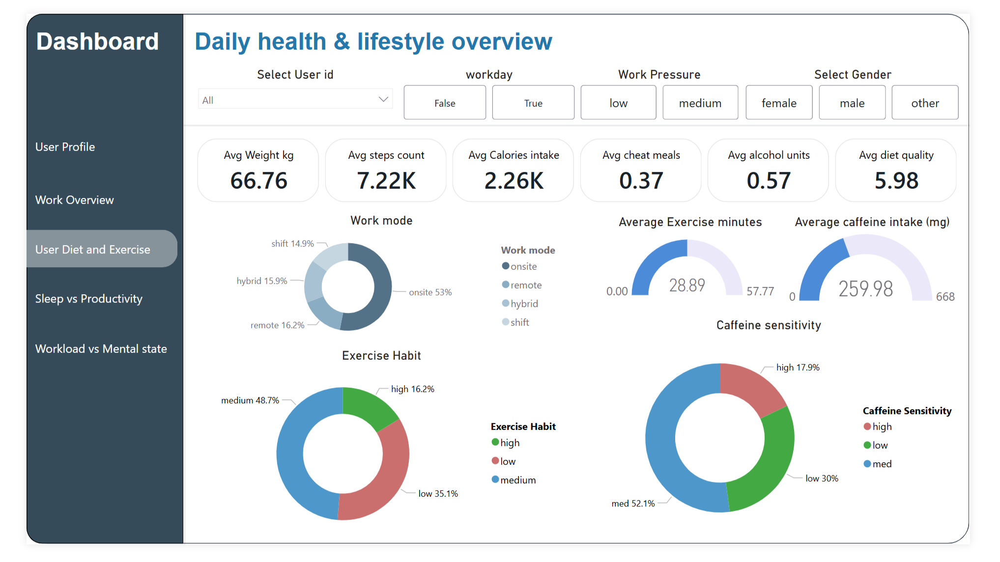
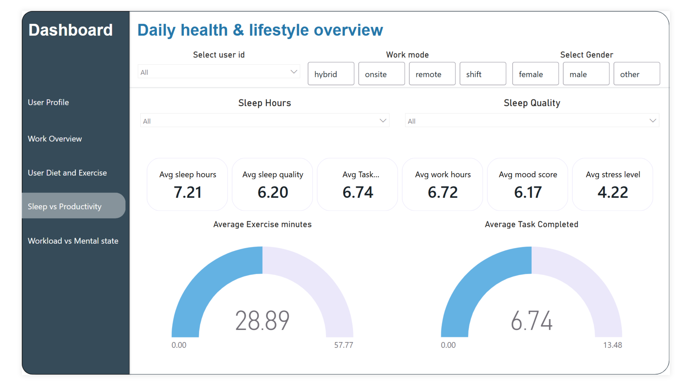
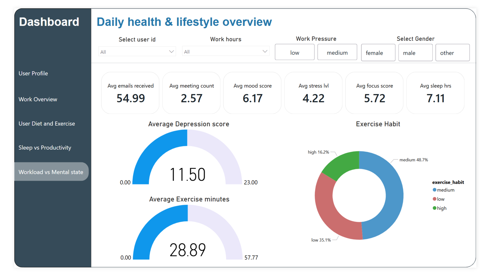

# 📊 Daily Health & Lifestyle Analytics Dashboard (Power BI)

This repository contains an interactive Power BI dashboard analyzing daily lifestyle habits, sleep patterns, diet, exercise behavior, work mode, mental well-being, and productivity.  
The report includes 5 bookmarks/pages with DAX-driven insights and interactive slicers.

---

## Project Overview

This dashboard provides analysis across:

- Sleep quality and duration  
- Diet and exercise behavior  
- Work mode and work pressure  
- Mental well-being indicators  
- Productivity metrics  
- User lifestyle habits  

It helps users understand how daily choices influence their performance and well-being.

---

## Dashboard Pages (Bookmarks)

### 1️⃣ User Profile
- Sleep hours and screen time  
- Age and BMI  
- Diet quality  
- Chronotype  
- Exercise habits  
- Profession distribution  

### 2️⃣ Work Overview
- Commute minutes  
- Work hours  
- Emails and meetings  
- Tasks completed  
- Stress, anxiety, energy, depression  
- Exercise habits  
- Caffeine sensitivity  

### 3️⃣ Diet & Exercise
- Steps count  
- Exercise minutes  
- Calories intake  
- Cheat meals  
- Alcohol units  
- Caffeine intake and sensitivity  

### 4️⃣ Sleep vs Productivity
- Sleep hours  
- Sleep quality  
- Tasks completed (gauge)  
- Work hours  
- Exercise minutes  
- Stress level  
- Mood score  

### 5️⃣ Workload vs Mental State
- Mood  
- Focus  
- Anxiety  
- Stress  
- Energy  
- Depression score  
- Exercise minutes  
- Work pressure impact  

---

## 🛠 Technologies Used

- Power BI Desktop  
- Power Query  
- DAX (Data Analysis Expressions)  
- KPIs, Bar charts, Donut charts, Gauge visuals  
- Bookmarks and slicers  

---

## 🔍 Key Insights

- Users with better sleep quality show higher productivity.  
- Hybrid and remote workers have more balanced lifestyle patterns than onsite and shift workers.
- Hybrid and remote workers have comparatively high job satisfaction and exercise habit and usually improved mental well-being.
- Increased work pressure results in high caffeine intake and less exercise activity.
- Increased work pressure results in higher stress and lower mood.
- Regular exercise strongly correlates with improved mental well-being.  

---

## 📂 Repository Structure

```
/daily-health-lifestyle-powerbi-dashboard
│── Dashboard.pbix
│── screenshots
│── Dashboard.gif
│── README.md
```

---

## 🖼 Screenshots







---

# Dashboard Video
Loading...


---
## 📥 PBIX Download

[Download_pbix](Life_Expectancy_Dashboard.pbix)

---

## ▶️ How to Use

1. 📥 Download the PBIX file  
2. 🖥 Open it in Power BI Desktop  
3. 🧭 Navigate using bookmarks  
4. 🎛 Adjust slicers to explore different user profiles and lifestyle patterns  

---

## 📬 Contact

**Muhammad Ahmed**  
Data Analyst – Power BI, SQL, Python, Excel  

🔗 LinkedIn: www.linkedin.com/in/ahmedtheanalyst  
📧 Email: raoahmadhnd76@gmail.com
